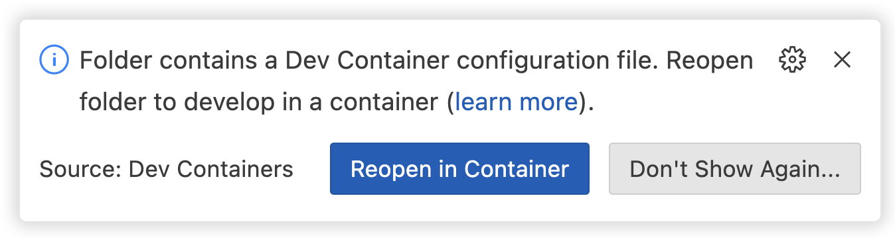

# Living with Machines GitHub Pages landing page

This repository contains the source code for the Living with Machines GitHub Pages landing page. The landing page is built using [Quarto](https://quarto.org/), an open-source scientific and technical publishing system built on top of [Pandoc](https://pandoc.org/).

The landing page is published at [https://living-with-machines.github.io/](https://living-with-machines.github.io/).

## Development

To build the landing page locally, you will need to install Quarto. You can do this by following the instructions in the [Quarto documentation](https://quarto.org/docs/getting-started/installation.html).

Once you have Quarto installed, you can build the landing page by running the following command in the root of the repository:

```bash
quarto preview
```

### Open as a VS Code project

This repository includes a `.devcontainer` directory that allows you to open the repository as a [Visual Studio Code Remote - Containers](https://code.visualstudio.com/docs/remote/containers) project. This will automatically set up a development environment with Quarto installed.

To open the repository as a VS Code project, follow these steps:

1. Install [Docker](https://www.docker.com/get-started) on your machine.

2. Install the [Dev Containers](https://marketplace.visualstudio.com/items?itemName=ms-vscode-remote.remote-containers) extension for Visual Studio Code.

3. Open the repository in Visual Studio Code. (You can do this by running `code .` in the root of the repository or by cloning the repository using the "Clone Repository in Container Volume" command in the Command Palette (Ctrl+Shift+P)).

4. VS Code should display an alert at the bottom right of the window saying "Folder contains a dev container configuration file. Reopen folder to develop in a container". Click "Reopen in Container".  If you don't see this alert, you can open the Command Palette (Ctrl+Shift+P) and run the "Dev Containers: Rebuild and Reopen in Container" command.  
  
   

5. VS Code will now open a new window in a containerized development environment. You can now build the landing page by running the following command in VS Code's built-in terminal:

   ```bash
    quarto preview book
    ```
